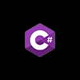
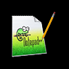
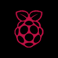

<h1 align="center">Profile of Nicola Preda</h1>
<h3 align="center">🚀 Novice Full Stack Developer & Designer</h3>

**What I'm working on : ⌨️**

- ⚡ Search Tool [TorchFlow](https://github.com/phoenixpixel-it/TorchFlow) With C# 

- 🚧 Open source project for no-profit society: [Vigevano 1 Website](https://github.com/Coding-Bunker/Gruppo-Scout-Vigevano-1)

- 📠 Frontend of an Industry 4.0 software in C# WPF

- 🌐 Building my personal [website](https://github.com/diskxo/diskxo.github.io)

**What am I learning : 📚**

- 📗 [Golang](https://golang.org/) programming language ([Test-Repository](https://github.com/diskxo/golang-learning))

- 🐍[Python](https://www.python.org/) & [Javascript](https://www.javascript.com/) programming languages

- 📚 Working with a developers team

- 🍭 Design with [Figma](https://figma.com)

**How to reach me : 🌎**

   
**Most used Languages, Frameworks & DataBases: 📟**

   
**Most used Tools & IDE : 🔧**

   
**My Distro : 💽**

  

  Stats :octocat:

#### GitHub Stats :bar_chart:

